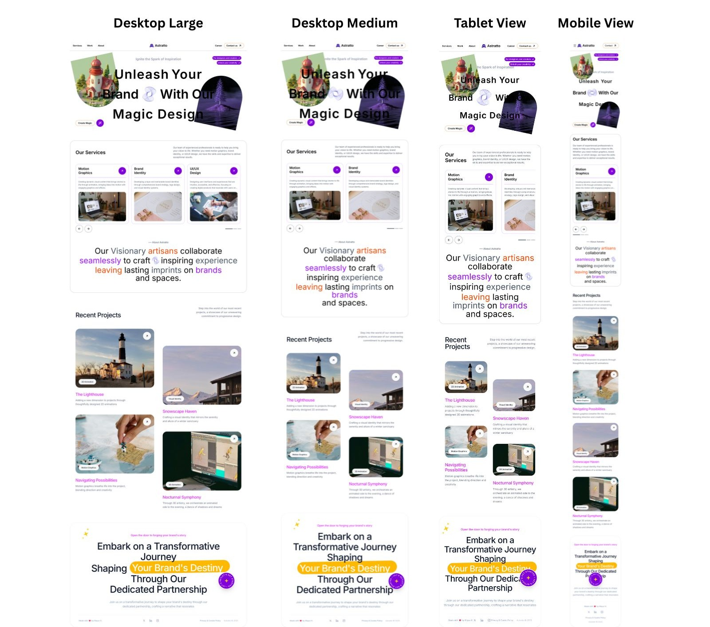

# Astratto - Creative Design Agency Website

A modern, animated portfolio website for a creative design agency specializing in motion graphics, brand identity, and UI/UX design. Built with React, Vite, Tailwind CSS, and Framer Motion for stunning animations.

## 📸 Screenshots



## 🚀 Features

- **Modern Design**: Clean, contemporary layout with smooth animations
- **Interactive Elements**: Hover effects, scroll animations, and interactive components
- **Responsive Layout**: Mobile-first design that works on all screen sizes
- **Performance Optimized**: Built with modern tooling for fast loading
- **Accessibility**: Reduced motion support for users with motion sensitivity

## 🛠️ Tech Stack

- **Frontend Framework**: React 19
- **Build Tool**: Vite
- **Styling**: Tailwind CSS
- **Animations**: Framer Motion, GSAP
- **Icons**: Lucide React
- **Linting**: ESLint

## 📋 Project Structure

```
src/
├── components/          # Reusable components
│   ├── Footer.jsx      # Footer with animated elements
│   ├── Magnetic.jsx    # Magnetic hover effect component
│   ├── Navbar.jsx      # Navigation header
│   ├── ProjectCard.jsx # Project display card
│   └── ServiceCard.jsx # Service display card
├── sections/            # Main page sections
│   ├── HeroSection.jsx # Hero section with animations
│   ├── ProjectSection.jsx # Project showcase
│   └── ServicesSection.jsx # Services display
├── App.jsx             # Main application component
├── index.css           # Global styles
└── main.jsx            # Entry point
```

## 🎨 Design Services

The website showcases the following services:

- **Motion Graphics**: Dynamic visual content that brings stories to life through animation
- **Brand Identity**: Comprehensive brand strategy, logo design, and visual identity systems
- **UI/UX Design**: Intuitive, accessible, and effective user interfaces and experiences

## 📦 Installation

1. Clone the repository:
```bash
git clone <repository-url>
```

2. Navigate to the project directory:
```bash
cd astratto_website
```

3. Install dependencies:
```bash
npm install
```

4. Start the development server:
```bash
npm run dev
```

5. Open your browser to `http://localhost:5173`

## 🚀 Usage

### Development
```bash
npm run dev
```
Starts the development server with hot reloading.

### Build
```bash
npm run build
```
Creates a production-ready build in the `dist` folder.

### Linting
```bash
npm run lint
```
Checks code for linting errors.

### Preview
```bash
npm run preview
```
Locally preview the production build.

## 🤝 Contributing

1. Fork the repository
2. Create a feature branch (`git checkout -b feature/amazing-feature`)
3. Commit your changes (`git commit -m 'Add amazing feature'`)
4. Push to the branch (`git push origin feature/amazing-feature`)
5. Open a Pull Request

## 📄 License

This project is licensed under the MIT License - see the [LICENSE](LICENSE) file for details.

## 👨‍💻 Author

Mayur K.

## 📞 Contact

Connect with us to discuss your next creative project!

---

*Crafted with ❤️ for creative professionals who want to showcase their work with stunning animations and modern design.*